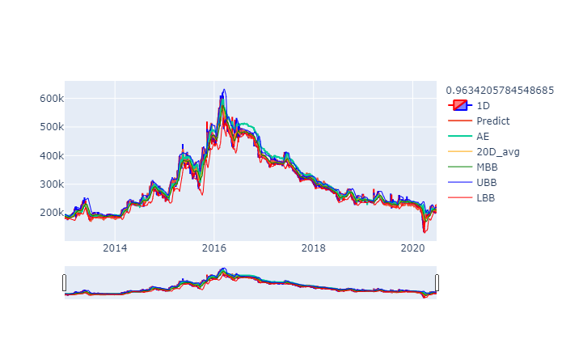

# stock_analysis

데이터 스크래핑부터 머신러닝을 이용한 가격 예측을 구현한 프로젝트입니다. 스크래핑은 네이버와 다음 페이지를 이용하였으며 머신러닝 모델은 "A deep learning framework for financial time series using stacked autoencoders and long-short term memory" 논문을 이용하여 재구현하였습니다. 논문에 대한 내용은 [다른 저장소](https://github.com/kbj2060/MachineLearningForStudy/tree/master/Papers/A%20deep%20learning%20framework%20for%20financial%20time)에 정리해놓았습니다. 이 가격 예측을 토대로 [다른 저장소](https://github.com/kbj2060/pytrader)에 있는 키움 API를 이용한 pytrader와 결합하여 예측하고 매수하는 과정까지 해결할 예정입니다.

<br/>

## Environments

------------------------------------------------

* OS : Windows
* Lang : Python3
* GUI : PyQt5

<br/>

## How It Works

------------------------------------------

1. 데이터를 모으기 위해 stock_analysis/src/scraping/scraping.py를 실행시킵니다. 
2. stock_analysis/main.py 를 실행시켜 분석 및 예측할 수 있습니다.
3. 실행 결과는 각 종목마다 아래의 그림처럼 plotly 라이브러리를 이용하여 html 파일이 만듭니다.

<br/>



<br/>

## Reports

----------------------------------------------------------

report 디렉토리에 분석, 어플리케이션, 예측, 스크래핑, 학습의 에러 로그를 볼 수 있습니다. 학습의 결과는 plotly 라이브러리를 이용한 html 파일 형태로 저장되어 위 그림처럼 나타나게 됩니다.

<br/>

## Config

---------------------------------------------------------------

src/system_trading/PARAMETER.py 파일을 이용하여 하이퍼파라미터를 조절할 수 있습니다.

``` python
BATCH_SIZE = 7
TIME_STEPS = 15
EPOCH = 10
ITERATIONS = 50
LSTM_UNITS = 64

LEARNING_RATE = 0.0003
DROPOUT_SIZE = 0.3
```

<br/>